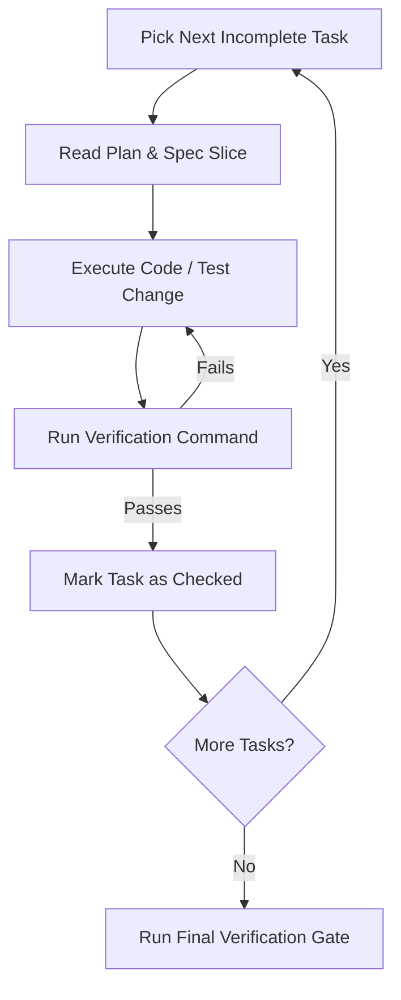

# Spec Implementation & Execution Protocol

## Purpose

The **Implementation Phase** executes the tasks defined in `specs/<feature-id>/tasks.md` against the locked contracts in `plan.md` and requirements in `spec.md`.

In Spec-Driven Development, execution is disciplined, linear, and verification-gated.

---

## The Execution Loop

Follow this exact loop for each task in `tasks.md`:



---

## Non-Negotiable Rules During Implementation

### 1. One Task at a Time
Never combine tasks or jump ahead. If Task 1.1 is defining Zod schemas, write only the schemas and types. Do not start writing database queries or controllers until their respective tasks are reached.

### 2. The Verification Gate Is Mandatory
Never mark a task `[x]` based on an assumption. You must run the exact verification command specified in the task (e.g. `npm test tests/...`, `npm run typecheck`) and confirm it exits with code 0.

### 3. The Zero-Drift Rule (Spec Immutability)
If, while coding, you discover that a proposed schema or architecture in `plan.md` does not work (e.g., an external API requires a different format, or a database constraint requires a composite key):

> [!CAUTION]
> **DO NOT silently deviate from the spec in code.**
> 1. Stop coding immediately.
> 2. Present the issue to the developer with the necessary adjustment:
>    *"While implementing Task 2.2, I discovered that field X must be an array instead of a string because... Should we update plan.md to reflect this?"*
> 3. Update `plan.md` (and `spec.md` if acceptance criteria change).
> 4. Resume coding only after the spec is updated.

---

## Final Delivery Protocol

When all tasks in `tasks.md` are marked complete:

1. **Run Project Quality Gate:**
   ```bash
   npm run typecheck && npm run lint && npm test
   ```
2. **Review Spec Status:**
   - Update `specs/<feature-id>/spec.md` Status to `Implemented`.
   - Update `specs/<feature-id>/plan.md` Status to `Completed`.
   - Update `specs/<feature-id>/tasks.md` Progress to `All tasks completed`.
3. **Offer Next Action:**
   - Ask developer: *"All tasks passed verification. Would you like me to commit these changes using `/git-commit` or open a PR using `/create-pr`?"*
