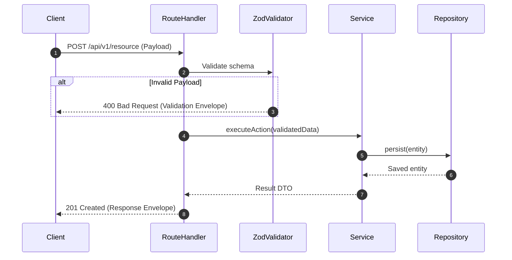

# Technical Implementation Plan Reference (`plan.md`)

## Purpose

The **Technical Plan** (`specs/<feature-id>/plan.md`) defines **how** the approved specification will be implemented in code.

In Spec-Driven Development, the plan locks down data contracts, interface types, and system seams **before writing implementation logic**. By drafting schemas and contracts in `plan.md`, the AI agent has unambiguous targets to code against, completely preventing hallucinated property names or endpoint shapes.

---

## Technical Plan Template

Save to: `specs/<NNN-feature-name>/plan.md`

```markdown
# Technical Plan: [Feature Title]

> **Feature ID:** [NNN-feature-name]
> **Spec Reference:** [spec.md](./spec.md)
> **Status:** Draft | Approved | In Progress | Completed
> **Last Updated:** YYYY-MM-DD

---

## 1. Architecture Overview & System Seams

### Affected Components
| Component / Module | Path / Location | Change Type | Responsibility |
| :--- | :--- | :--- | :--- |
| **Routes** | `src/api/routes/[resource].ts` | Modify / New | Route validation, auth middleware, controller binding |
| **Service Layer** | `src/services/[resource].service.ts` | New | Pure business logic, state transitions |
| **Data Access** | `src/repositories/[resource].repo.ts` | Modify | Database queries, transactions |
| **Types / Schemas** | `src/types/[resource].ts` | New | Zod schemas, TypeScript types, DTO contracts |

### Architectural Flow


---

## 2. Interface Contracts & Data Models

> [!IMPORTANT]
> All schemas and contracts below must be locked before starting task execution.

### Data Schemas (Zod / TypeScript)
```typescript
import { z } from 'zod';

export const CreateResourceRequestSchema = z.object({
  name: z.string().min(3).max(50),
  email: z.string().email(),
  role: z.enum(['admin', 'member']).default('member'),
});

export type CreateResourceRequest = z.infer<typeof CreateResourceRequestSchema>;

export const ResourceResponseSchema = z.object({
  id: z.string().uuid(),
  name: z.string(),
  email: z.string().email(),
  role: z.enum(['admin', 'member']),
  createdAt: z.string().datetime(),
});

export type ResourceResponse = z.infer<typeof ResourceResponseSchema>;
```

### Database Schema / Migrations
```prisma
// Changes to prisma/schema.prisma
model Resource {
  id        String   @id @default(uuid())
  name      String
  email     String   @unique
  role      String   @default("member")
  createdAt DateTime @default(now())
  updatedAt DateTime @updatedAt

  @@index([email])
}
```

### HTTP API Contract
| Method | Endpoint | Auth | Request Body | Success Response | Error Codes |
| :--- | :--- | :--- | :--- | :--- | :--- |
| `POST` | `/api/v1/resources` | Bearer JWT | `CreateResourceRequest` | `201 Created` (`ResourceResponse`) | `400` Validation, `409` Conflict, `500` Internal |
| `GET` | `/api/v1/resources/:id` | Bearer JWT | None | `200 OK` (`ResourceResponse`) | `404` Not Found, `401` Unauthorized |

---

## 3. Testing Strategy & Verification Seams

- **Test Seams:**
  - Route tests (`tests/integration/routes/...`): Execute against a lightweight test server with supertest.
  - Service tests (`tests/unit/services/...`): Pure unit tests mocking the database repository.
- **Verification Gates:**
  - Contract conformance: Payload matches Zod schema exactly.
  - Edge testing: Tests for 400 validation failures and 409 conflict scenarios.

---

## 4. Dependencies & Security Review

- **New Packages:** [List any required npm packages, or state "None - using existing dependencies"].
- **Auth & Permissions:** [Verify token verification, rate limiting, and permission checks].
- **Audit / Logging:** [State what events must be logged, e.g., resource creation, auth failure].
```

---

## Quality Checklist

Before moving to the **Tasks** phase, verify:

- [ ] Are all affected files and components listed with their change type?
- [ ] Are TypeScript/Zod interfaces and data models written out completely (not left as placeholders)?
- [ ] Are HTTP routes, inputs, outputs, and status codes explicitly defined in a contract table?
- [ ] Does the plan respect the project's `specs/constitution.md`?
