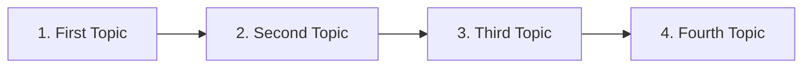
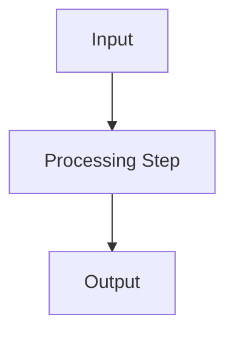
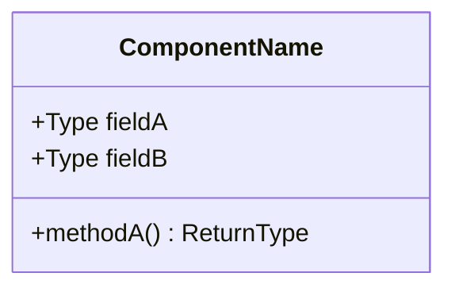
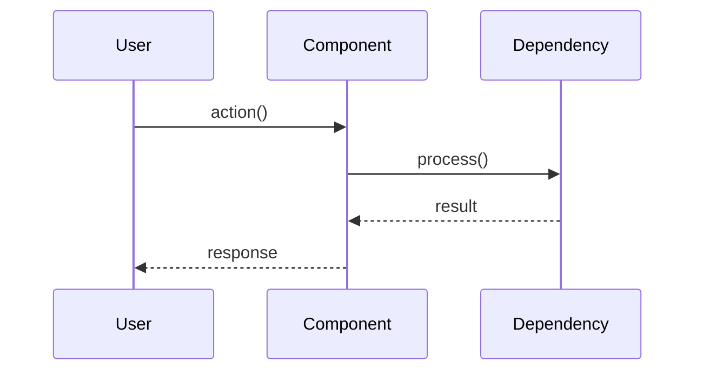

# MDX Page Templates

> Copy-paste these templates when creating new documentation pages.
> Each template uses the correct components for its content type.

---

## 1. Section Index Page

> Use when creating a new folder under `content/docs/`. This is the `index.mdx` that
> introduces the section and links to all child pages.
> **Convention**: Set `title: Overview` to prevent repeating the parent section name in the sidebar.

```mdx
---
title: Overview
description: One-line summary of what this section covers
---

Brief 1–2 sentence introduction to this section. Explain what the reader will learn
and why it matters.

---

## Reading Order



---

## Explore This Section

<Cards>
  <Card
    icon={<Compass />}
    title="First Topic"
    description="Brief description of what this page covers"
    href="/docs/section/first-topic"
  />
  <Card
    icon={<Layers />}
    title="Second Topic"
    description="Brief description of what this page covers"
    href="/docs/section/second-topic"
  />
  <Card
    icon={<Wrench />}
    title="Third Topic"
    description="Brief description of what this page covers"
    href="/docs/section/third-topic"
  />
</Cards>
```

---

## 2. Concept / Explainer Page

> Use for pages that explain a concept, theory, or design rationale.

```mdx
---
title: Concept Name
description: Clear one-line definition of the concept
---

Opening paragraph that defines the concept and explains why the reader should care.
Keep it to 2–3 sentences maximum.

---

## How It Works

Narrative explanation of the mechanism. Use a diagram to show the flow:



---

## Key Properties

| Property | Value | Description |
| :--- | :--- | :--- |
| **Property A** | `value` | What this property controls |
| **Property B** | `value` | What this property controls |

---

## Trade-Offs

<Callout type="warn">
  ### Important Consideration
  Explain the main trade-off or limitation of this approach.
</Callout>

---

## Comparison

<Tabs items={['Approach A', 'Approach B']}>
  <Tab value="Approach A">
    Explain approach A with code examples if applicable.
  </Tab>
  <Tab value="Approach B">
    Explain approach B with code examples if applicable.
  </Tab>
</Tabs>

---

## Related Pages

<Cards>
  <Card
    icon={<Layers />}
    title="Related Concept"
    description="How this concept connects to another"
    href="/docs/related"
  />
</Cards>
```

---

## 3. Setup / Installation Guide

> Use for pages that walk the reader through a multi-step process.

```mdx
---
title: Setup Guide Title
description: Step-by-step guide to set up X
---

This guide walks you through setting up X from scratch. By the end, you'll have
a fully working Y.

---

## Prerequisites

<Callout type="info">
  Before starting, ensure you have:
  - Node.js ≥ 18
  - npm or pnpm installed
  - A GitHub account
</Callout>

---

## Installation

<Steps>
  <Step>
    ### Install Dependencies

    <Tabs items={['npm', 'pnpm', 'yarn']}>
      <Tab value="npm">
        ```bash
        npm install package-a package-b
        ```
      </Tab>
      <Tab value="pnpm">
        ```bash
        pnpm add package-a package-b
        ```
      </Tab>
      <Tab value="yarn">
        ```bash
        yarn add package-a package-b
        ```
      </Tab>
    </Tabs>
  </Step>
  <Step>
    ### Configure the Project

    Create the configuration file:

    ```typescript title="config.ts"
    export default {
      // configuration here
    };
    ```
  </Step>
  <Step>
    ### Verify Installation

    Run the development server:

    ```bash
    npm run dev
    ```

    Open `http://localhost:3000` to verify everything works.
  </Step>
</Steps>

---

## Project Structure

After setup, your project should look like:

<Files>
  <Folder name="src" defaultOpen>
    <Folder name="app">
      <File name="layout.tsx" />
      <File name="page.tsx" />
    </Folder>
    <Folder name="components">
      <File name="mdx.tsx" />
    </Folder>
  </Folder>
  <File name="package.json" />
  <File name="tsconfig.json" />
</Files>

---

## Troubleshooting

<Accordions>
  <Accordion title="Error: Module not found" id="module-not-found">
    Ensure all dependencies are installed by running `npm install` again.
    Check that your `tsconfig.json` includes the correct paths.
  </Accordion>
  <Accordion title="Page not rendering" id="page-not-rendering">
    Verify that the content file exists under `content/docs/` and that
    `meta.json` includes the page in its `pages` array.
  </Accordion>
</Accordions>
```

---

## 4. Technical Specification Page

> Use for spec pages that define interfaces, behavior, and acceptance criteria.

```mdx
---
title: ComponentName
description: Brief statement of what this component does
---

One-sentence purpose statement.

---

## Purpose

What this component does and why it exists. 2–3 sentences maximum.

---

## Interface

```typescript
interface ComponentAPI {
  methodA(param: Type): ReturnType;
  methodB(param: Type): ReturnType;
}
```

| Method | Parameters | Returns | Description |
| :--- | :--- | :--- | :--- |
| `methodA` | `param: Type` | `ReturnType` | What this method does |
| `methodB` | `param: Type` | `ReturnType` | What this method does |

---

## State & Data Model



---

## Behavior



---

## Invariants

<Callout type="error">
  These conditions must **always** hold true:

  1. Invariant one — description
  2. Invariant two — description
  3. Invariant three — description
</Callout>

---

## Edge Cases

| Scenario | Expected Behavior |
| :--- | :--- |
| Edge case 1 | How the system handles it |
| Edge case 2 | How the system handles it |

---

## Acceptance Criteria

- [ ] Criterion one
- [ ] Criterion two
- [ ] Criterion three

---

## Status

`Draft` | `In Review` | `Approved` | `Implemented` | `Outdated`
```

---

## 5. API Reference Page

> Use for documenting function signatures, parameters, return types.

```mdx
---
title: API Reference — ModuleName
description: Complete API documentation for ModuleName
full: true
---

Complete API reference for the `ModuleName` module.

<InlineTOC />

---

## `functionA()`

Description of what this function does.

### Parameters

| Parameter | Type | Required | Default | Description |
| :--- | :--- | :---: | :--- | :--- |
| `paramA` | `string` | ✓ | — | What this parameter controls |
| `paramB` | `number` | — | `10` | What this parameter controls |
| `options` | `Options` | — | `{}` | Configuration object |

### Returns

`ReturnType` — Description of the return value.

### Example

```typescript
const result = functionA('value', 42, { key: true });
```

---

## `functionB()`

Description of what this function does.

### Parameters

| Parameter | Type | Required | Default | Description |
| :--- | :--- | :---: | :--- | :--- |
| `input` | `InputType` | ✓ | — | Input data |

### Returns

`Promise<OutputType>` — Async result.

### Example

```typescript
const output = await functionB({ data: 'value' });
```
```

---

## 6. `meta.json` Template

```json
{
  "title": "Section Title",
  "icon": "Compass",
  "pages": ["index", "page-a", "page-b", "page-c"]
}
```

### Root `meta.json` with Separators

```json
{
  "pages": [
    "---Welcome---",
    "index",
    "---Section Group A---",
    "section-a",
    "section-b",
    "---Section Group B---",
    "...nested-section",
    "standalone-page"
  ]
}
```
