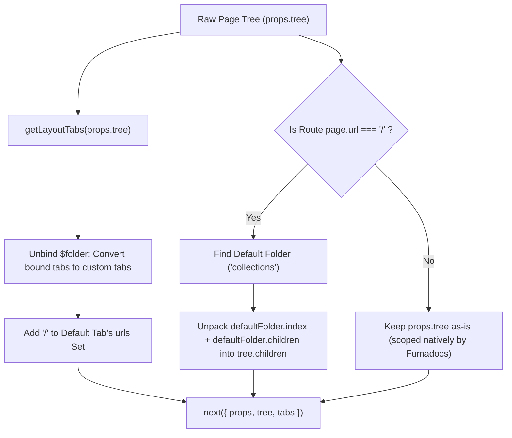

# Root Section / Framework Switcher Setup Guide (Fumapress & Fumadocs)

This guide explains how to implement a persistent root-level section or framework switcher dropdown (e.g., switching between **Guides**, **API Reference**, or distinct frameworks/products) in Fumapress and Fumadocs. It addresses the default behaviors where the switcher disappears on the root route (`/`) and duplicate collapsible folder toggles render beneath it, and provides a complete, type-safe implementation.

> **Project Agnostic Note**: In the code examples throughout this reference, `/collections` (as the default section) and `/oops` (as a secondary section) are used as concrete illustrations. The architecture applies identically to any domain (e.g., `/guides`, `/api`, `/sdk`, `/frontend`, `/backend`). Substitute your project's section folder names and URLs accordingly.

---

## 1. Overview & Desired Behavior

### Multi-Section Directory Layout
When organizing large documentation repositories into distinct sections, each section is configured as an independent root subject using `"root": "subject"` in its `meta.json`:

```
content/
├── index.mdx          # Root homepage (/)
├── collections/
│   ├── index.mdx      # /collections
│   └── meta.json      # { "title": "Collections", "root": "subject" }
└── oops/
    ├── index.mdx      # /oops
    └── meta.json      # { "title": "OOPs", "root": "subject" }
```

### The Target UX
On the root page (`/`), users should see a clean, scoped section switcher dropdown in the sidebar:

```
┌────────────────────────────────────┐
│  ▦  Collections                 ˅ │
└────────────────────────────────────┘
```

1. **Active State on `/`**: The switcher displays the default section (**Collections**) as active.
2. **Clean Root Sidebar**: The sidebar displays the default section's pages directly, without redundant collapsible `Collections >` or `OOPs >` folder chevrons.
3. **Seamless Switching**:
   - Selecting **OOPs** navigates to `/oops` with the OOPs section active and scoped.
   - Selecting **Collections** navigates to `/collections` with Collections active and scoped.
4. **Preserved Multi-Section Isolation**: Sub-pages in each section retain their dedicated sidebar scope.

---

## 2. Fumadocs Internals: Why Default Behavior Fails

### 2.1 Why the Switcher Disappears on `/`

Fumadocs renders section tabs via `SidebarTabsDropdown` (`fumadocs-ui`), which calls the internal hook `useTabsGroups`:

```tsx
// fumadocs-ui/contexts/tree
function useTabsGroups(tabs) {
  const { full: tree } = useTreeContext();
  const path = use(PathContext); // Ancestor node chain for the active route

  return useMemo(() => {
    const out = [];
    for (const node of path) {
      if (node.type !== "folder" || !node.root) continue;
      collectTabs(scope, node, page, tabs, group.options);
      if (group.options.length > 0) out.push(group);
    }

    // Tabs not bound to a folder ($folder is undefined) are treated as custom tabs
    const custom = tabs.filter((tab) => !tab.$folder);
    if (custom.length > 0) {
      const group = out.findLast((group) => group.active?.root === true);
      if (group) group.options.push(...custom);
      else out.push({ options: custom });
    }
    return out;
  }, [tabs, tree, path]);
}
```

By default:
1. **No Folder Ancestor on `/`**: On `/`, the active `PathContext` contains only `[ Page("/") ]`. There is **no folder node** in the active path.
2. **Loop Skips**: `for (const node of path)` skips because no node has `node.type === "folder"`.
3. **Bound Tabs Excluded**: Tabs auto-generated by `getLayoutTabs(tree)` bind to their respective `PageTree.Folder` nodes via `$folder`. Because `!tab.$folder` evaluates to `false`, the `custom` list is empty.
4. **Dropdown Collapses**: `useTabsGroups()` returns `[]`, causing `SidebarTabsDropdown` not to render at all on `/`.
5. **No Active Tab Match**: Even if forced to render, `isLayoutTabActive` verifies whether the active path contains `tab.$folder`. Because `/` is outside both folders, neither tab matches.

### 2.2 Why Folder Toggles Render on `/`

In `fumadocs-ui`, `SidebarPageTree` renders the tree items:
```tsx
const { root } = useTreeContext();
return renderList(root.children);
```

- When visiting `/collections` or `/oops`, `TreeContextProvider` finds the matching root folder in `PathContext` and sets `root` to that folder.
- When visiting `/`, no root folder exists in `PathContext`. Fumadocs falls back to the top-level tree (`props.tree.children`), which contains:
  - `Page("/")`
  - `Folder("collections")` (renders with a collapsible disclosure chevron `>`)
  - `Folder("oops")` (renders with a collapsible disclosure chevron `>`)

---

## 3. Architecture & Solution Mechanics

To solve both issues in Fumapress (or custom Fumadocs layouts), intercept layout rendering via `createDocsLayoutPage` and `renderLayout`:



### Core Mechanisms:

1. **Unbind `$folder`**: Strip `$folder` (`const { $folder, ...rest } = tab`). This classifies the tabs as custom tabs in `useTabsGroups`, forcing the switcher to stay visible across all routes (including `/`).
2. **Assign `"/"` to Default Section**: Set `urls: new Set(["/", "/collections"])` on the default tab. `isLayoutTabActive` tests `tab.urls.has("/")`, evaluates to `true`, and marks the default section active on `/`.
3. **Scope Sidebar Tree on `/`**: When `page.url === "/"`, locate the default section folder in `props.tree.children` and assign its unpacked pages directly to `tree.children`.
4. **Attach Icons**: Supply Lucide icons (`<LayoutGrid className="size-4" />`, `<Boxes className="size-4" />`) to each tab's `icon` property.
5. **Preserve Section Scoping on Sub-Routes**: Non-root routes retain `props.tree`, allowing Fumadocs's native `TreeContextProvider` to isolate sections as expected.

---

## 4. Critical Implementation Details

### 4.1 Unpacking `PageTree.Folder` Nodes

In Fumadocs's AST, a folder node (`PageTree.Folder`) has the following structure:
```ts
interface Folder {
  type: 'folder';
  name: ReactNode;
  root?: boolean | string;
  index?: PageTree.Item; // The folder's index.mdx (e.g. /collections)
  children: PageTree.Node[]; // Sibling pages or subdirectories inside the folder
}
```

> [!IMPORTANT]
> The folder's own index page (`content/collections/index.mdx`) resides in `folder.index`, **not** inside `folder.children`.
> If you only assign `children: defaultFolder.children`, the section index page will vanish from the sidebar. You must unpack both:
> ```tsx
> children: defaultFolder.index
>   ? [defaultFolder.index, ...defaultFolder.children]
>   : defaultFolder.children
> ```

### 4.2 Order of Operations in `renderLayout`

The execution order inside `renderLayout` is vital:
```tsx
renderLayout({ props, page, next }) {
  // 1. MUST generate tabs from the FULL tree first!
  const tabs = getLayoutTabs(props.tree).map((tab) => { ... });

  // 2. Only THEN scope props.tree for the root page:
  let tree = props.tree;
  if (page.url === "/") {
    const defaultFolder = ...;
    tree = { ...props.tree, children: ... };
  }

  // 3. Pass both scoped tree and full tabs to next:
  return next({
    ...props,
    tree,
    tabs,
  });
}
```

> [!WARNING]
> If you modify `props.tree` before calling `getLayoutTabs(props.tree)`, `getLayoutTabs` will only see the unpacked collections items and will **fail to discover the OOPs section**. The switcher dropdown will then lose the OOPs option!

### 4.3 TypeScript Type-Safety Nuances

In Fumadocs, `node.name` on `PageTree.Folder` is typed as `ReactNode` (`string | number | bigint | boolean | ReactElement | ...`):
- Direct invocation `node.name.toLowerCase() === "collections"` triggers TypeScript errors (`TS18049: 'node.name' is possibly null/undefined` and `TS2339: Property 'toLowerCase' does not exist on type 'number'`).
- Always check `$ref?.folder` and string-guarded `name`:
  ```tsx
  const defaultFolder = props.tree.children.find(
    (node) =>
      node.type === "folder" &&
      (node.$ref?.folder === "collections" ||
        (typeof node.name === "string" &&
          node.name.toLowerCase() === "collections")),
  );
  ```

### 4.4 Icon Handling: Guarding Against String Icons in `meta.json`

If `lucideIconsPlugin()` is not configured in your source loader, setting `"icon": "Layers"` in `meta.json` passes the **raw string** `"Layers"` into `tab.icon`.
- If your layout evaluates `tab.icon ?? <FallbackIcon />`, the raw text `"Layers"` is returned because it is truthy.
- Fumadocs renders the icon inside a fixed-width `16px` icon wrapper (`size-4`). The raw text overflows that 16px container and renders directly over the section title (e.g. producing overlapping text like **`LayeCollections`**).
- **Rule**: Always verify that `tab.icon` is a valid React node and not a string before using it, or configure icons programmatically:
  ```tsx
  icon:
    (typeof tab.icon !== "string" && tab.icon)
      ? tab.icon
      : (tab.url === "/collections" ? <LayoutGrid className="size-4" /> : undefined)
  ```

### 4.5 Recursive Section URLs for Subpage Active State

When `$folder` is unbound to allow custom tabs across `/`, Fumadocs's `isLayoutTabActive` uses `tab.urls` to determine whether the tab is active:
```ts
if (tab.urls) return tab.urls.has(normalize(pathname));
return isActive(tab.url, pathname, true);
```
> [!CAUTION]
> If you assign a static set like `urls: new Set(["/", "/collections"])`, navigating to any nested page (e.g. `/collections/demo`) causes `tab.urls.has("/collections/demo")` to return `false`. Because `tab.urls` exists, prefix matching is bypassed. With no active tab, the entire switcher dropdown disappears on subpages!
>
> **Fix**: Collect all recursive page URLs from `$folder` using a recursive helper (`getFolderUrls`) before unbinding `$folder`, and then add `"/"` to the default section.

---

## 5. Complete Configuration Reference

### 5.1 `press.config.tsx` (Fumapress)

```tsx
import { defineConfig } from "fumapress";
import { createDocsLayoutPage } from "fumapress/layouts/docs";
import { getLayoutTabs } from "fumadocs-ui/layouts/shared";
import { fumadocsMdx } from "fumapress/adapters/mdx";
import { metaSchema, pageSchema } from "fumapress/adapters/mdx/schema";
import { defineDocs } from "fumadocs-mdx/macro";
import { LayoutGrid, Boxes } from "lucide-react";
import defaultMdxComponents, { createRelativeLink } from "fumadocs-ui/mdx";
import { Tab, Tabs } from "fumadocs-ui/components/tabs";
import { Step, Steps } from "fumadocs-ui/components/steps";
import { Accordion, Accordions } from "fumadocs-ui/components/accordion";
import { File, Files, Folder } from "fumadocs-ui/components/files";

const docs = defineDocs({
  dir: "content",
  docs: {
    async: true,
    schema: pageSchema,
    lastModified: true,
    postprocess: {
      includeProcessedMarkdown: true,
    },
  },
  meta: {
    schema: metaSchema,
  },
});

function getFolderUrls(folder: any, output = new Set<string>()): Set<string> {
  if (folder.index?.url) output.add(folder.index.url);
  if (Array.isArray(folder.children)) {
    for (const child of folder.children) {
      if (child.type === "page" && !child.external && child.url) {
        output.add(child.url);
      }
      if (child.type === "folder") {
        getFolderUrls(child, output);
      }
    }
  }
  return output;
}

export default defineConfig({
  content: docs.toFumadocsSource(),
  site: {
    name: "Documentation",
  },
  renderPage: createDocsLayoutPage({
    renderLayout({ props, page, next }) {
      // 1. Generate full layout tabs from root tree with raw transform
      const tabs = getLayoutTabs(props.tree, {
        transform: (option) => option,
      }).map((tab) => {
        const { $folder, ...rest } = tab;
        // Collect all sub-page URLs so switcher stays active on nested pages
        const urls = $folder ? getFolderUrls($folder) : new Set<string>([tab.url]);
        if (tab.url === "/collections") {
          urls.add("/");
        }

        return {
          ...rest,
          icon: resolveIcon(tab.icon) ?? (
            tab.url === "/collections" ? (
              <LayoutGrid className="size-4" />
            ) : tab.url === "/oops" ? (
              <Boxes className="size-4" />
            ) : undefined
          ),
          urls,
        };
      });

      // 2. On root route '/', unpack default section items into tree.children
      let tree = props.tree;
      if (page.url === "/") {
        const defaultFolder = props.tree.children.find(
          (node) =>
            node.type === "folder" &&
            (node.$ref?.folder === "collections" ||
              (typeof node.name === "string" &&
                node.name.toLowerCase() === "collections")),
        );

        if (defaultFolder && defaultFolder.type === "folder") {
          tree = {
            ...props.tree,
            children: defaultFolder.index
              ? [defaultFolder.index, ...defaultFolder.children]
              : defaultFolder.children,
          };
        }
      }

      // Automatically convert any string icons and key tree.$id to page.url so TreeContextProvider recomputes on client navigation
      tree = {
        ...tree,
        $id: `root-${page.url}`,
        children: tree.children.map(resolveTreeIcons),
      };

      // 3. Delegate to next layout handler with transformed tabs and scoped tree
      return next({
        ...props,
        tree,
        tabs,
      });
    },
  }),
}).adapters(
  fumadocsMdx({
    async getMdxComponents(page) {
      return {
        ...defaultMdxComponents,
        a: createRelativeLink(await this.getLoader(), page),
        Tabs,
        Tab,
        Steps,
        Step,
        Accordion,
        Accordions,
        File,
        Files,
        Folder,
      };
    },
  })
);
```

### 5.2 Section `meta.json` Files

Every root section folder must define `"root": "subject"`:

`content/collections/meta.json`:
```json
{
  "title": "Collections",
  "root": "subject"
}
```

`content/oops/meta.json`:
```json
{
  "title": "OOPs",
  "root": "subject"
}
```

---

## 6. Runtime Matrix Across Routes

| Route | `page.url` | `tree` Passed to Layout | Section Switcher | Sidebar Tree Content |
| :--- | :--- | :--- | :--- | :--- |
| `/` | `"/"` | Scoped to default folder (`[defaultFolder.index, ...children]`) | Active: **Collections** (`urls.has("/") === true`) | Collections docs directly; no folder chevrons |
| `/collections` | `"/collections"` | Full original tree | Active: **Collections** | Collections docs (scoped natively by `TreeContextProvider`) |
| `/oops` | `"/oops"` | Full original tree | Active: **OOPs** | OOPs docs (scoped natively by `TreeContextProvider`) |

---

## 7. Adding a New Section (Zero Config Changes)

To add another section (e.g. `dsa`):

1. **Create Section Folder**: `content/dsa/`
2. **Add `meta.json`**:
   ```json
   {
     "title": "DSA",
     "icon": "Binary",
     "root": "subject"
   }
   ```
3. **Add Section Index**: Create `content/dsa/index.mdx`.
4. **Dynamic Icon**: Any Lucide icon specified in `meta.json` resolves automatically without modifying `press.config.tsx`.
5. **Dev Server Watcher**: If Vite does not immediately reflect a brand new directory on Windows while `npm run dev` is running, restart `npm run dev` or save `press.config.tsx` once to trigger discovery.

